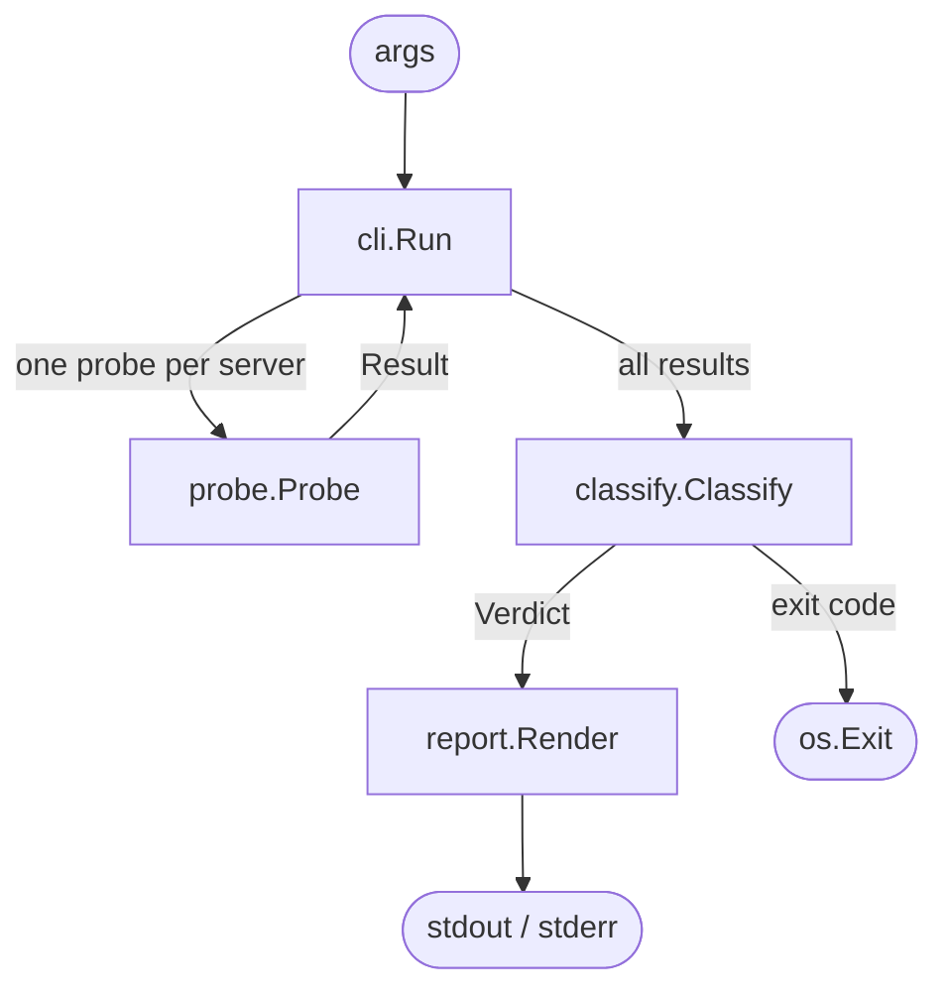

# natcheck — Architecture

> Status: v0.1.2 shipped (RFC 5780 §4.4 filtering classification). v0.2 design contract is the addendum at end of document; v0.1.3 (hairpinning) and v0.1.4 (`natcheck server`) remain planned.
> Last updated: 2026-04-26

Product framing and technical spec. v0.1 spec lives in this document as shipped; v0.2 design is the addendum at the end. Working notes and per-phase plans live in `todos/` (dev-internal, not tracked in git).

## Problem

Every WebRTC, P2P, or VPN developer hits the same question when connections fail: *"what kind of NAT am I behind, and will my connections work?"* Today, answering that means:

- Running `stun-client` against one or two servers and eyeballing the mapped address
- Finding a dusty online NAT classifier that may or may not still work
- Reading RFC 5780 to understand what "endpoint-independent mapping" means in practice
- Guessing at whether the result means your P2P app will or won't work

The answer exists in scattered pieces. No one tool packages it.

## Audience

Two user personas, both served by the same default invocation:

1. **WebRTC / P2P developer debugging connectivity.** Wants a fast, unambiguous answer: "will direct P2P work from this network, and if not, is TURN required?" Time budget: 5 seconds.
2. **Curious network person.** Wants to understand their home or office NAT in RFC 5780 terms. Time budget: a minute, with willingness to read one paragraph of explanation.

Secondary: CI scripts that want to assert a network's NAT type before running integration tests. Served by `--json` output + well-defined exit codes.

## Value proposition

- **One command, one answer.** `natcheck` with no flags produces a complete report.
- **Human-readable by default, machine-readable on request.** Default output is a screenful; `--json` is pipeable.
- **Honest about limits.** Many public STUN servers don't support RFC 5780 CHANGE-REQUEST, so full classification is sometimes impossible. The tool says so instead of guessing.
- **No setup.** Single binary, no services to run, no config files required.
- **Pion-native.** Built on `pion/stun`, pure Go, single static binary.

## v0.1 scope

In:

- STUN Binding request against 2+ servers (defaults: `stun.l.google.com:19302`, `stun.cloudflare.com:3478`)
- Public endpoint reporting (IP:port as observed by each server)
- Mapping-behavior classification: Endpoint-Independent vs Address/Port-Dependent, based on whether mapped endpoints agree across servers
- RTT measurement per server
- Human-readable default output (one screen)
- `--json` flag for structured output
- `--verbose` flag showing each STUN transaction
- `--server host:port` flag, repeatable, to add or override servers
- `--timeout duration` flag (default 5s)
- `--version`, `--help`
- WebRTC forecast: `likely | possible | unlikely | unknown` (v0.1 emits `likely`, `unlikely`, `unknown`; `possible` is reserved for v0.2 filtering and CGNAT calibration)
- CGNAT heuristic warning (if mapped IP is in 100.64.0.0/10)
- Exit codes: 0 (P2P-friendly), 1 (P2P-hostile), 2 (probe error)

Out of scope:

- Filtering behavior (requires RFC 5780 `CHANGE-REQUEST` support, which most public STUN servers don't implement)
- Hairpinning test (requires an echo helper)
- TURN probing
- IPv6 exhaustive testing (works in practice via `pion/stun` + Go's net package when available, but not a tested contract)
- Multi-interface enumeration
- Continuous monitoring / watch mode
- TUI
- TCP STUN

## Non-goals

- Not a general network diagnostic tool. Scope is NAT and STUN only.
- Not a TURN server or relay. `natcheck` probes; it doesn't serve.
- Not a WebRTC test harness. For end-to-end WebRTC testing, use pion's examples or `webrtc-internals`.

## UX shape

### Default invocation

```
$ natcheck
Direct P2P: likely
NAT type: Endpoint-Independent Mapping (cone)
Public endpoint: 203.0.113.45:51820

Probes:
  stun.l.google.com:19302   rtt=24ms  mapped=203.0.113.45:51820
  stun.cloudflare.com:3478  rtt=31ms  mapped=203.0.113.45:51820

Filtering not tested (v0.1).
```

Forecast leads the output so the WebRTC-dev persona gets the answer on line 1. Classification detail follows for the curious reader.

### JSON invocation

```json
{
  "nat_type": "EIM",
  "nat_type_legacy": "cone",
  "public_endpoint": "203.0.113.45:51820",
  "probes": [
    {"server": "stun.l.google.com:19302", "rtt_ms": 24, "mapped": "203.0.113.45:51820"},
    {"server": "stun.cloudflare.com:3478", "rtt_ms": 31, "mapped": "203.0.113.45:51820"}
  ],
  "webrtc_forecast": {"direct_p2p": "likely", "turn_required": false},
  "warnings": ["filtering_behavior_not_tested"]
}
```

The JSON schema is a public contract from v0.1 onward; only additive changes after release.

### Failure modes

- All probes timeout → exit 2, report per-server errors
- Mapped endpoints disagree across servers → NAT type "Address-Dependent Mapping" (or APDM if we can distinguish; v0.1 reports "ADM or stricter"), exit 1, forecast `unlikely`
- Mapped IP in `100.64.0.0/10` → warning `cgnat_detected`, forecast `unknown`

## Architecture

Single binary, four internal packages. No daemons, no config files by default, no external services beyond the STUN servers being probed.

```
cmd/natcheck/main.go          Entry point, calls cli.Run
internal/cli/                 Flag parsing, orchestration, exit codes
internal/probe/               STUN Binding requests, RTT capture
internal/classify/            Probe results → NAT-type verdict
internal/report/              Verdict → human text or JSON
```

### Data flow

```
args
 │
 ▼
cli.Run ─────────► probe.Probe  (×N concurrent, one per server)
 │                    │
 │◄── probe.Result ───┘
 │
 ▼
classify.Classify ─► Verdict ─► report.Render ─► stdout / stderr
                       │
                       └─► exit code (0 / 1 / 2)
```



## Dependencies

- **Runtime:** `github.com/pion/stun/v3` (latest stable). Nothing else for v0.1.
- **Dev:** `golangci-lint` v2.9.0+.
- **Go version:** 1.25+.

Rejected for v0.1:

- `cobra` / `urfave/cli` — `flag` is sufficient for a single-command CLI with < 10 flags.
- `zerolog` / `slog` — `fmt` is sufficient; structured logging arrives if and when the tool gains subcommands.
- `viper` — no config file in v0.1.

## Package contracts

### `internal/probe`

```go
type Server struct {
    Host string
    Port int
}

type Result struct {
    Server Server
    Mapped netip.AddrPort  // zero if probe failed
    RTT    time.Duration   // zero if probe failed
    Err    error           // nil on success
}

type Prober interface {
    Probe(ctx context.Context, s Server) Result
}
```

One `Prober` implementation: `stunProber` using `pion/stun` primitives (`Build`/`Decode`) over raw UDP. Cancellation is bridged via `conn.SetDeadline` from `ctx.Done`. Returns zero-value `Result` with non-nil `Err` on failure; callers never panic. One-shot — no retransmission; the caller's timeout is the retry budget.

### `internal/classify`

```go
type NATType int

const (
    Unknown NATType = iota
    EndpointIndependentMapping  // RFC 5780, "cone"
    AddressDependentMapping     // RFC 5780
    AddressPortDependentMapping // RFC 5780, "symmetric"
    Blocked                     // all probes failed
)

type Verdict struct {
    Type            NATType
    LegacyName      string    // "cone", "symmetric", etc.
    PublicEndpoint  netip.AddrPort
    CGNAT           bool
    FilteringTested bool      // false in v0.1 always
    Warnings        []string
    Forecast        Forecast
}

type Forecast struct {
    DirectP2P    string // "likely" | "possible" | "unlikely" | "unknown" (v0.1 emits {likely, unlikely, unknown}; "possible" reserved for v0.2)
    TURNRequired bool
}

func Classify(results []probe.Result) Verdict
```

Pure function. No I/O. Table-driven tests cover RFC 5780 classification boundaries, CGNAT detection, and the partial-failure matrix (0/N, 1/N both orderings, N/N probes successful).

### `internal/report`

```go
type Format int

const (
    FormatHuman Format = iota
    FormatJSON
)

func Render(w io.Writer, v classify.Verdict, probes []probe.Result, format Format) error
```

Human format is hand-rolled string building, forecast-first. JSON format uses `encoding/json` with tagged structs, pinned by golden-file tests (EIM cone, ADM strict, Blocked) since the schema is a public contract.

### `internal/cli`

```go
type Options struct {
    Servers []probe.Server
    Timeout time.Duration
    JSON    bool
    Verbose bool
}

func Run(ctx context.Context, args []string, out, errOut io.Writer) int
```

Returns exit code. Parses flags, defaults servers, runs probes concurrently (one goroutine per server, bounded by timeout), calls `Classify`, calls `Render`. Testable in-process with a fake `Prober`.

## Default STUN servers

v0.1 ships with two defaults, both well-known and free:

1. `stun.l.google.com:19302`
2. `stun.cloudflare.com:3478`

Adding a third would make classification marginally more robust; two plus `--server` override is sufficient. If a default server times out, we still report what we learned from the others and warn.

## RFC 5780 classification (v0.1 partial)

With only basic STUN Binding responses (no `CHANGE-REQUEST`), we can determine:

- **Mapping behavior:**
  - Two servers on different IPs, probed from the same local port, return the *same* mapped endpoint → Endpoint-Independent Mapping
  - Different mapped endpoints → Address-Dependent or Address-Port-Dependent Mapping. v0.1 cannot distinguish ADM from APDM without `CHANGE-REQUEST`; it reports "ADM or stricter" and emits warning `adm_or_stricter`.

What v0.1 cannot determine:

- Filtering behavior (requires `CHANGE-REQUEST`)
- Hairpinning behavior (requires a helper that echoes to the mapped endpoint)

## CGNAT detection

If the observed public IP falls in `100.64.0.0/10` (RFC 6598 shared address space), emit warning `cgnat_detected`. CGNAT typically prevents inbound direct P2P but doesn't prevent outbound STUN.

Forecast on CGNAT: `DirectP2P = "unknown"`. Real-world direct-P2P success on CGNAT varies by carrier; returning `unknown` is the honest answer in the absence of a confident signal.

## Concurrency model

Probe goroutines run in parallel, one per server, all bounded by a single context timeout. If the global timeout fires, in-flight probes are cancelled and their results recorded as errors. `Classify` waits for all probes (success or error) before running.

## Testing strategy

- **`internal/probe`:** integration tests against an in-process fake STUN responder (spawned per-test). No network required in CI.
- **`internal/classify`:** table-driven unit tests covering every combination of probe outcomes, including the partial-failure matrix (0/2, 1/2 both orderings, 2/2). Target ≥ 80% coverage; this is the brain of the tool.
- **`internal/report`:** golden-file tests for human output; schema-stability golden-file tests for JSON with three fixtures (EIM cone, ADM strict, Blocked).
- **`internal/cli`:** in-process test with a fake `Prober`; asserts exit codes and orchestration.
- **`cmd/natcheck`:** no test; entry point is three lines.

No live-network test in CI. Manual verification against real networks before release; sample outputs committed under `docs/samples/`.

## Build and release

- `make build` → single binary in repo root, versioned via `-ldflags "-X main.version=..."`
- `make test` → unit + integration with in-process test server, no network
- `make lint` → `golangci-lint` v2.9.0
- Release: `git tag v0.1.0`, push.

## Non-functional targets

- Cold-start probe completes in < 2s on a healthy network
- Binary size < 15 MB static
- `--json` schema is a public contract; additive changes only after v0.1
- `internal/classify` test coverage ≥ 80%
- `go install github.com/1mb-dev/natcheck/cmd/natcheck@latest` works with no further setup

## Security considerations

- No private keys, no credentials, no user data sent to STUN servers beyond the standard Binding request.
- `--server` accepts user input; validate `host:port` shape before handing to `pion/stun`.
- Treat STUN responses as untrusted: `pion/stun` handles parsing. No further eval.
- No subprocess execution. No file I/O (no config file in v0.1).

---

# v0.2 design (addendum)

> Added: 2026-04-26
> Status: design contract. Implementation staged across v0.1.2 → v0.1.3 → v0.1.4 → v0.2.0 patches.

## Goal

RFC 5780 parity with `pion/stun-nat-behaviour` on protocol rigor while preserving the v0.1 UX contract: one command, pinned JSON, honest CGNAT handling, layered exit codes.

## Staged sequence

v0.2 is a milestone reached via four bisectable patches, not a single release. Each patch is independently shippable with real user value.

| Patch | Status | Adds |
|---|---|---|
| **v0.1.2** | shipped (PRs #7–#11, tag `v0.1.2`) | RFC 5780 §4.4 filtering classification (capability-driven via `--server` advertising `OTHER-ADDRESS`); JSON `filtering` object; classifier upgrade emitting reserved `possible`; coturn reference config asset + setup doc; `internal/stunserver` foundation package |
| **v0.1.3** | planned | Hairpinning detection via two local sockets, parallel with mapping probes; JSON `hairpinning` field |
| **v0.1.4** | planned | `natcheck server` subcommand: stateless RFC 5780 §3 STUN responder. Promoted from in-process responder via shared `internal/stunserver/` package |
| **v0.2.0** | planned | Version bump; README + site copy reconciliation; CHANGELOG with v0.1 → v0.2 JSON migration section |

v0.2.0 is the line where downstream consumers can rely on the new schema fields.

## JSON schema delta (additive only)

```jsonc
{
  // existing v0.1 fields unchanged
  "nat_type": "EIM",
  "nat_type_legacy": "cone",
  "public_endpoint": "203.0.113.45:51820",
  "probes": [...],
  "webrtc_forecast": { "direct_p2p": "likely", "turn_required": false },
  "warnings": [],

  // NEW in v0.1.2
  "filtering": {
    "behavior": "endpoint-independent" | "address-dependent" | "address-and-port-dependent" | "untested",
    "tested_against": "stun.example.com:3478"
  },

  // NEW in v0.1.3
  "hairpinning": true | false | null
}
```

- `filtering.tested_against` is omitted when `behavior == "untested"`.
- `hairpinning: null` distinguishes "tested and false" from "didn't try."
- Schema additivity discipline: once these fields ship, all future filtering / hairpinning fields nest under their respective objects or break the v0.1.2 / v0.1.3 contract.

A v0.1-equivalent golden fixture (filtering=untested, hairpinning=null) is pinned as a regression check on the omitted-field path.

## CLI delta

### Client side: no new flags

Filtering activates automatically when the configured server's Binding response includes `OTHER-ADDRESS`. Hairpinning runs by default — local-only, parallel with mapping probes, no wall-clock cost in the common case.

Verbose output emits coded warning constants in `warnings[]`:

| Constant | Condition |
|---|---|
| `WarnFilteringSkippedNoChangeRequest` | Server didn't advertise `OTHER-ADDRESS` |
| `WarnFilteringPartial` | One or more CHANGE-REQUEST probes failed |
| `WarnHairpinUntested` | Local socket allocation failed; hairpinning probe could not run |

No free-text warning strings.

### Server side (v0.1.4)

```
natcheck server [--listen :3478] [--alt :3479] [--external-ip <addr>]
```

Flat invocation. No auth, no TLS, no rate limiting in v0.2 — diagnostic-test posture, mirroring the bundled coturn reference config. Documented as a diagnostic instance, not a production STUN service.

## Filtering classification (v0.1.2)

Implements RFC 5780 §4.4. Sequence:

1. Standard Binding request to a server advertising `OTHER-ADDRESS` (the cooperating server).
2. Binding with `CHANGE-REQUEST = CHANGE-IP | CHANGE-PORT` — server responds from alternate IP and port.
3. Binding with `CHANGE-REQUEST = CHANGE-PORT` — server responds from same IP, alternate port.

Outcome mapping:

| Test 2 reply | Test 3 reply | Filtering |
|---|---|---|
| received | received | endpoint-independent |
| not received | received | address-dependent |
| not received | not received | address-and-port-dependent |

If the server doesn't advertise `OTHER-ADDRESS`, all filtering tests skip; `WarnFilteringSkippedNoChangeRequest` is emitted; `filtering.behavior = "untested"`.

## Hairpinning detection (v0.1.3)

Two local UDP sockets, parallel with mapping probes:

1. Allocate sockets A and B.
2. STUN-probe each (concurrent with the existing `--server` probes, no extra round-trip cost) to obtain mapped endpoints `mA`, `mB`.
3. From A, send a uniquely-tagged UDP packet to `mB`.
4. Listen on B for `T_hairpin` (default 1s).

Result:

- Tagged packet arrives → `hairpinning: true`
- Timeout → `hairpinning: false`
- A or B's STUN probe failed → `hairpinning: null` + `WarnHairpinUntested`

Documented limitation: false-negative possible if the NAT applies port-restricted filtering on the hairpin path. Test case in `internal/probe/hairpin_test.go` simulates this scenario via the existing fake-responder pattern.

## `natcheck server` subcommand (v0.1.4)

Stateless RFC 5780 §3 STUN responder.

In scope:

- STUN Binding response with `XOR-MAPPED-ADDRESS`.
- `CHANGE-REQUEST` handling: respond from alt-port, and from alt-IP if `--external-ip` is set.
- `OTHER-ADDRESS` advertised in every response.
- Structured logs to stderr.

Out of scope for v0.2 (deliberate, not demand-gated):

- TLS / DTLS termination.
- Auth or rate limiting.
- Persistence, metrics endpoint, or admin surface.
- TURN allocation handling.

Diagnostic-test posture is the deliberate v0.2 shape, mirroring the bundled coturn config. Production hardening is a separate decision after v0.2.0 ships, evaluated on its own merit.

### Code organization

`internal/stunserver/` is the responder API boundary. Public surface:

```go
package stunserver

func New(opts Options) *Server
func (s *Server) Handle(req []byte, src netip.AddrPort) []byte
func (s *Server) Serve(ctx context.Context, conn net.PacketConn) error
```

- `Handle` is pure: byte-in, byte-out, no I/O. Used directly by the in-process test fake via in-memory channels.
- `Serve` wraps `Handle` with a real `net.PacketConn` dispatch loop. Used by the `natcheck server` subcommand.
- One implementation, two consumption modes. Single source of truth for RFC 5780 §3 responder behavior.

`cmd/natcheck/server.go` is flag parsing plus `stunserver.Serve(ctx, opts)`. If responder logic leaks into `cmd/natcheck/`, it is a bug.

`Handle` is unit-tested as a pure function (response construction, CHANGE-REQUEST flag parsing, OTHER-ADDRESS attribute placement). `Serve` is integration-tested with real sockets. The split follows what is actually being tested, not what coverage tools prefer.

## Classifier upgrade

`internal/classify` extends to consume `filtering.behavior` and `hairpinning` when present. The `webrtc_forecast.direct_p2p` enum surface is unchanged; the value distribution shifts:

| Available data | Forecast change vs. v0.1 |
|---|---|
| Mapping only (no filtering, no hairpinning) | Identical to v0.1 |
| + Filtering data | `unknown` cases drop where filtering disambiguates EIM-with-restrictive-filtering from true APDM. `possible` starts emitting for EIM × Address-Dependent Filtering combinations. |
| + Hairpinning data | Refines the `possible` / `likely` boundary for cases where hairpinning matters (e.g., behind-the-same-NAT peers). |
| + CGNAT calibration sample (issue #6) | Carrier-tagged `possible` or `unlikely` replaces `unknown` for matching public IPs. |

Forecast field stays singular. The UX promise — "one command, one answer" — is preserved.

## coturn reference config (v0.1.2)

`examples/coturn-natcheck.conf`:

```conf
listening-port=3478
alt-listening-port=3479
listening-ip=0.0.0.0
external-ip=YOUR_PUBLIC_IP
no-auth
no-tls
no-dtls
log-file=stdout
```

Setup doc (`docs/coturn-setup.md`): one page, three sections — what it is, how to run it, how to point natcheck at it. Explicit warnings:

- `no-auth no-tls no-dtls` is **diagnostic-test only**, not a production TURN/STUN service.
- `external-ip` on cloud VMs is the public IP, not the network interface IP. Common stumbling block.

References coturn's own README for everything beyond the natcheck-specific config.

## Validation strategy for v0.2.0 ship

Project-owner one-shot:

1. Spin up `natcheck server` on a $5 VPS.
2. Run `natcheck --server <vps>:3478` from at least three different client networks.
3. Capture one redacted sample to `docs/samples/filtering.txt`.
4. Tear down the VPS after capture.

No project-run reference instance committed in v0.2. Whether to run a public reference instance is a separate decision after v0.2.0 ships, evaluated on operational cost vs. user-onboarding leverage.

## v0.2 non-goals (explicit)

- TURN probing — v0.3.
- IPv6 as a tested contract — v0.3.
- Multi-interface enumeration — v0.3.
- `natcheck server` production hardening (auth, TLS, rate limiting, metrics) — separate decision after v0.2.0.
- Project-run public reference instance — separate decision after v0.2.0.

## Risks

1. **`natcheck server` adoption depends on users having a VPS.** Mitigation: coturn reference config also ships; users with existing TURN/STUN infrastructure are not forced to natcheck-server.
2. **Hairpinning two-socket method has documented false-negative cases.** Mitigation: limitation documented, explicit test case, `null` value distinguished from `false`.
3. **Schema additivity discipline.** Once `filtering.{behavior, tested_against}` and `hairpinning` ship, all future fields nest there or break the contract.
4. **Diagnostic-posture servers operated as production.** Mitigation: setup docs and `natcheck server --help` explicitly warn that the bundled config and the subcommand are not production STUN services. Production hardening is a separate decision after v0.2.0 ships.

